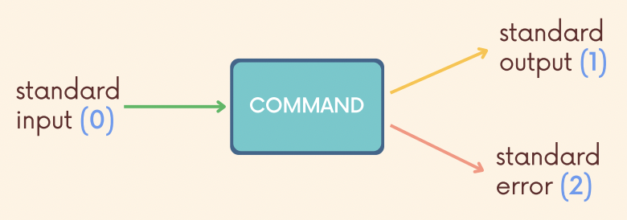

# Redirection


- Redirection describes the ways we can alter the source of standard input, and the destinations for standard output and standard error.

## Standard Streams

- The 3 standard streams are **communication channels** between a computer program and its environment.
  - Standard Input
  - Standard Output
  - Standard Error

### Standard Output

- Standard output is a place to which a program or command can send information.
- The information could go to a screen to be displayed, to a file, or even to a printer or other devices.

### Standard Input

- Standard input is where a program or command gets its input information from. By default, the shell directs standard input from the keyboard.
- The input information could come from a keyboard, a file, or even from another command.

### Standard Error

- Commands and programs also have a destination to send error messages: standard error.
- By default, the shell directs standard error information to the screen for us to read, but we can change that destination if needed.

## redirecting output

- The redirect output symbol `>` tells the shell to redirect the output of a command to a specific file instead of the screen.
- NOTE: `>` symbol must occur after any options and arguments.
- Syntax: `command > filename`
- `date > output.txt` output date to a file called output.txt
- `echo "moo" > cow.js` redirects the output of echo
- `ls -l > files.txt` saves the output of `ls -l` to a file.

## Appending

- When we redirect output using `>` any existing contents in the file are overwritten. Sometimes this is not what we want.
- To instead keep the existing contents in the file and add new content to the end of the file, use `>>` when redirecting.

```zsh
echo "hello" >> greeting.txt
echo "world" >> greeting.txt
cat greeting.txt

hello
world
```

- `cat list.txt >> files.txt` append list file contents into files txt

## redirecting input

- To pass the contents of a file to a standard input, use the `<` symbol followed by the filename.
- `cat` (and many other commands) are set up to accepts filenames as arguments directly, but we can also redirect to standard input manually.
- `command < filename`
- If you run `cat` only, the cursor is waiting in the terminal for input. When you type something and hit enter, it shows the output to the terminal.
  - But we can also redirect the contents of a file to the standard input `cat` like this `cat < filename.txt`
- e.g., `sort < alphabets.txt` or `sort -r < alphabets.txt`

## redirect standard input and output

- Can redirect standard input and output at the same time.
- `cat < original.txt > output.txt` using cat to read in the original.txt and then redirecting the output to a file called output.txt
- `sort < names.txt > sorted.txt`

## redirecting standard error

- By default, error messages are output to the screen, but we can change this by redirecting standard error.
- The standard error redirection operator is `2>`
- If we ran a command like `cat nonexistentfile` (where the file does not exist), we would see an error printed to the screen. We can instead redirect standard error to a file.
  - `cat nonexistentfile 2> error.txt`
  - `ls -zzz 2> error.txt`
- `2>>` append the error log to the same file
    - `ls -zzz 2>> error.txt`

## Why `2>`?



- Each stream gets its own numeric file descriptor, and for standard error the number is 2.
- The `>` operator actually defaults to using 1 as the file descriptor number, which is why we didn't need to specify `1>` to redirect standard output.
    - `date 1> now.txt` similar to `date > now.txt`
- Similarly, the `<` operator uses a default file descriptor number of 0, so don't need to specify `0<` to redirect to standard input.

## redirecting multiple streams

- `cat bees.txt ants.txt > insects.txt 2> error.txt`
- In the above example, we are concatenating 2 files, redirecting standard output to a file called insects.txt and redirecting standard error to a file called error.txt.
- **NOTE**: When redirecting both standard output and standard error, make sure standard output comes FIRST. Always redirect standard error after standard output.

## redirect both stdout and stderr to the same file

- Redirect standard error to the same location as standard output.
- `ls docs > output.txt 2> output.txt`
- `ls docs > output.txt 2>&1` shorter and fancier syntax
- `ls docs &> output.txt`
- `ls docs &>> output.txt` with appending