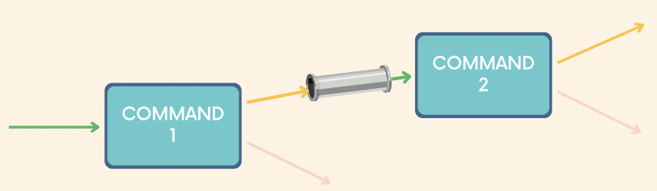

## Piping

- Purpose of piping: Combining multiple commands to build a pipeline.
- Pipes are used to redirect a stream from one program to another program. We can take the output of one command and redirect it to the input of another.
- The pipe character `|` separates 2 commands. The output of the first command will be passed to the standard input of the second command.
    - Syntax: `command1 | command2`
- `rev` and `cat` and `less` accepts input via stdin
    - `date | rev`
    - `date | cat`
    - `ls -l /usr/bin | less`
- `ls /usr/bin | wc -l` counting the number of lines where `wc -l` accepts a stdin

## `>` vs `|`

- Both the `>` character and the `|` character are used to **redirect output**. They do it in different ways.
- `>` connects a command to some file.
- `|` connects a command to another command
- Using `>` and `|` together
    - `ls -a /usr/bin | wc -l > count.txt`

## `tr`

- `cat msg | tr s S` replace all lowercase s with uppercase S
- `cat msg | tr a-z A-Z` replace all lowercase with uppercase
- `cat msg | tr -d s` delete all character 's'
- `cat data.txt | tr -d a-z` delete all lowercase alphabets
- `cat data.txt | tr -d [:alpha:]` delete all alphabets
- `cat data.txt | tr -d [:blank:]` remove all whitespaces
- `cat data.txt | tr -d :` remove colon
- `cat data.txt | tr -d [:alpha:] | tr -d : | tr -d [:blank:] > phones.txt` piping followed by saving output to a file