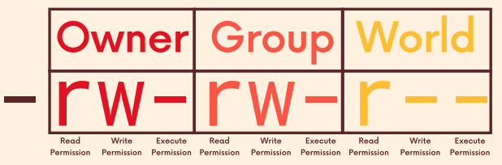
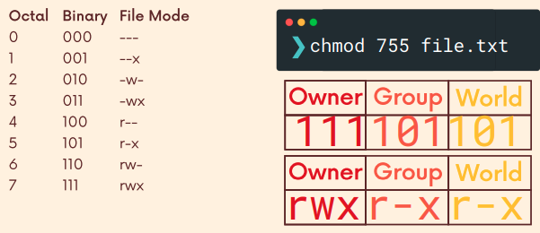

# Permissions

## Multiple Users

- Unix and unix-like systems are **multiuser** operating systems.
- More than 1 person can be using the same computer at the same time (though this is tough logistically with only 1 display and keyboard).
- Way back when computers were expensive, a university might only have 1 computer, but dozens of terminals sprinkled across campus.

## Permission Denied

- As regular users, we do not have permission to write or even read ever file on the machine.
- E.g., try to read the file `/etc/sudoers` with the command `cat /etc/sudoers` and you will get the "permission denied" message

## Groups

- On unix systems, a single user may be the owner of files and directories, meaning that they have control over their access.
- Additionally, users can belong to groups which are given access to particular files and folders by their owners.

## User & Group IDs

- When a new user account is made, it is assigned a user ID. The user is also assigned a group ID.
- We can use the `id` command to view user and group ids.
- User IDs are stored in `/etc/passwd`, and the group IDs are in `/etc/group`.

## File Attributes

- When you type `ls -l`, you might see 10 characters at the start like `drwxr-xr-x` or `-rw-r--r--`. These are the **file attributes**.
- These characters tell us the type of the file, the read, write, and execute permissions for the file's owner, the file's group owner and everyone else.
- **First character** indicates the **type of the file**.
  - `-`: regular file
  - `d`: directory
  - `c`: character special file (try `ls -l /dev`)
  - `l`: symbolic link (try `ls -l /dev`), made using `ln -s <filename> <newfile>`

## Permissions

| Character | Effect on Files                                                                           | Effect on Directories                                                                                                          | \   |
| :-------: | ----------------------------------------------------------------------------------------- | ------------------------------------------------------------------------------------------------------------------------------ | --- |
|    `r`    | file can be read                                                                          | directory's contents can be listed                                                                                             |
|    `w`    | file can be modified                                                                      | directory's contents can be modified (create new files, rename files/folders) but only is the executable attribute is also set |
|    `x`    | file can be treated as a program to be executed                                           | allows a directory to be entered or `cd` into                                                                                  |
|    `-`    | file cannot be read, modified, or executed depending on the location of the `-` character | directory contents cannot be shown, modified or `cd` into depending on the location of the `-` character                       |

## `chmod` command

- To change the permissions of a file or directory, we can use the `chmod` command (change mode).
- Syntax: `chmod mode file`
- To use `chmod` to alter permissions, need to tell it:
    - WHO we are changing permissions for?
    - WHAT changes are we making? Adding? Removing?
    - WHICH permissions are we setting?
- When specifying permissions with `chmod`, we use a special syntax to write permission statements. First, we specify the "who" using the following values:
    - `u`: user (the owner of the file)
    - `g`: group (members of the group the file belongs to)
    - `o`: others (the "world", everyone else)
    - `a`: all of the above
- Next, we tell `chmod` "what" we are doing using the following characters:
    - `-` (minus sign) removes the permission
    - `+` (plus sign) grants the permission
    - `=` (equals sign) set a permission and removes others
- FInally, the "which" values are:
    - `r`: read permission
    - `w`: write permission
    - `x`: execute permission

## Examples of `chmod` commands

- `chmod g+w file.txt` adding write permission to group. E.g., `-rw-r--r--` becomes `-rw-rw-r--`
- `chmod a-w file.txt` remove write permission all. E.g., `-rw-rw-r--` becomes `-r--r--r--`
- `chmod u+x file.txt` add executable permissions for owner. E.g., `-rw-rw-r--` becomes `-rwxrw-r--`
- `chmod a=r file.txt` set permissions to read ONLY for all. E.g., `-rwxrwxr--` becomes `-r--r--r--`

## `chmod` octals

- `chmod` also supports another way of representing permission patterns: octal numbers (base 8). Each digit in an octal number represents 3 binary digits.
- Total combinations for `rwx` is 8 (`2*2*2`).
- `chmod 700 file.txt` equates to `-rwx------`
- `chmod 644 file.txt` equates to `-rw-r--r--`

## `su` command - substitute user

- There may be times we want to start a shell as another user, from within our own shell session. 
- Can use the `su` command to do that.
- For example, `su - leonlow` would create a new login shell for the user leonlow. We would need to enter leonlow's password. To leave the session, type `exit`
- `su --login <username>` or `su - <username>` is the recommended way to substitute user with a fresh environment and shell.
- `su <username.` switch to another user but retain the current environment.